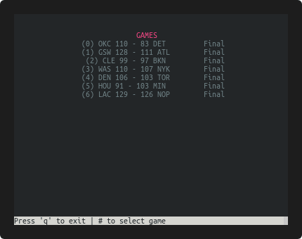

# NBA Scores CLI

This is a small cli app that will check and display NBA scores for you. On the back end it uses the `data.nba.com`'s powerful free api. My original intention was for this to have up-to-date scores for ongoing games. Unfortunately NBA's free api seems to throttle updates so data is updated only every 10-15 minutes. As a result this app is only really useful for checking past games and stats. And as a fun experiment with python's curses package.

<p align="center">
  
</p>

## Prerequisites
* python3
* virtualenv

## Utilization
``` bash
# Build environment
make develop

# To run for today
make

# To run for a different day
source .venv/bin/activate
./nba_scores_cli/nba_scores.py -h

usage: nba_scores.py [-h] [--offset OFFSET] [--date DATE]

CLI app to check NBA scores

optional arguments:
  -h, --help       show this help message and exit
  --offset OFFSET  Days offset from today
  --date DATE      Reference Date eg "01-15-2019" (default: today)

```

Once app is launched can navigate to game details using number keys, can go back with 'b' and can quit with 'q'

## TO DOs
- [ ] Avoid crashing on days with >10 games by assigning letters or symbols to games 11+
- [ ] Prevent crashing if window is resized to small
- [ ] Colors!
- [ ] Opening title screen for ego purposes
- [ ] Other data for past games!! play-by-play? game leaders?

## Thanks to:
* [nba_py](https://github.com/seemethere/nba_py) for a good reference to the api
